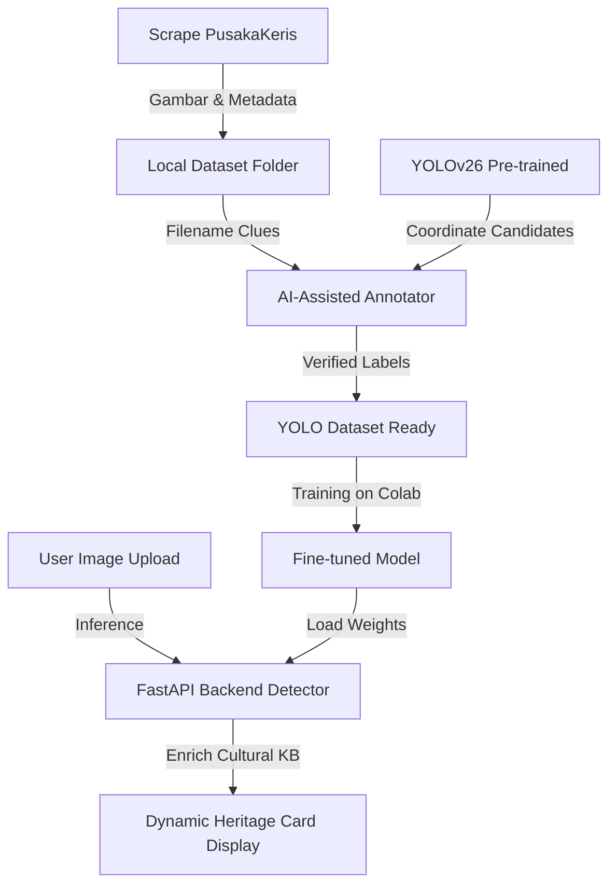

# 🗡️ YOLOv26-Based Kris Detection and Classification for Madura Cultural Heritage Preservation

[](https://fastapi.tiangolo.com)
[](https://react.dev)
[](https://docs.ultralytics.com)
[](https://github.com/astral-sh/uv)

Repositori ini dikembangkan untuk penelitian tesis **"YOLOv26-Based Kris Detection and Classification for Madura Cultural Heritage Preservation"**. Sistem ini mengintegrasikan pengumpulan data otomatis, anotasi berbantuan model *deep learning* lokal, dan interpretasi visual keris yang dihubungkan dengan Knowledge Base nilai kebudayaan dan sejarah Madura.

---

## 🔮 Fitur Utama

- 🕷️ **Dataset Crawler & Builder**: Otomasi scraping katalog detail dari `pusakakeris.com/katalog` (hingga 54 halaman) untuk mengumpulkan gambar beresolusi tinggi, data Dapur, Pamor, Tangguh, dan harga secara aman dan sopan.
- ✏️ **AI-Assisted Canvas Annotator**: Antarmuka visual interaktif untuk menggambar Bounding Box dengan bantuan rekomendasi offline YOLOv26 (AI Pre-Anote) serta parse metadata otomatis dari nama file.
- 🧠 **YOLOv26 Object Detector**: Identifikasi objek real-time menggunakan arsitektur termodern **YOLOv26** untuk melokalisasi bilah keris secara instan.
- 🏺 **Madura Cultural Heritage Cards**: Menampilkan detail Dapur (bentuk), Pamor (motif tempa), Tangguh (era pembuatan), Empu pembuat, serta nilai filosofis budaya kearifan lokal Sumenep (UNESCO Intangible Heritage).
- 📓 **Google Colab Ready**: Menyediakan notebook mandiri `.ipynb` untuk melakukan alur *training* dan evaluasi model pada GPU T4 secara gratis.

---

## 🛠️ Arsitektur & Teknologi



### Stack Teknologi:
- **Backend**: Python 3.13, FastAPI, Uvicorn, Pyright.
- **Deep Learning**: Ultralytics YOLOv26, OpenCV, PyTorch, NumPy.
- **Frontend**: React 18, Vite 5, Lucide Icons, Vanilla CSS (Golden Cultural Palette).
- **Environment**: Rust-based `uv` package manager for virtual environment management.

---

## 📂 Struktur Project

```
deteksi-keris/
├── backend/
│   ├── app.py              # Server API utama (FastAPI)
│   ├── crawler.py          # Logika scraping produk & gambar
│   ├── detector.py         # Inferensi YOLOv26 & query Knowledge Base
│   └── knowledge_base.json # Basis Data kebudayaan Madura (dapur, pamor, empu)
├── frontend/
│   ├── src/
│   │   ├── App.jsx         # Antarmuka Dashboard utama React
│   │   └── index.css       # Pengaturan visual & token warna (gold heritage)
│   ├── package.json        # Dependensi modul javascript
│   └── vite.config.js      # Proxy server dan router
├── colab/
│   └── YOLOv26_Kris_Detection_Colab.ipynb # Notebook Jupyter untuk Google Colab T4
├── pyproject.toml          # Manajemen dependensi python terpadu via UV
└── uv.lock                 # Lockfile dependensi python workspace
```

---

## ⚡ Langkah Memulai (Panduan Cepat)

### 1. Prasyarat
Pastikan sistem Anda sudah terinstal **Node.js** dan **uv** (Package manager Python tercepat berbasis Rust).
Jika belum memiliki `uv`, pasang dengan perintah berikut:
```powershell
# Windows (PowerShell)
powershell -c "irm https://astral.sh/uv/install.ps1 | iex"
```

### 2. Kloning & Sinkronisasi Python Environment
```bash
# Clone repositori
git clone https://github.com/username/deteksi-keris.git
cd deteksi-keris

# Sinkronkan venv dan instal seluruh paket python secara otomatis
uv sync
```

### 3. Menjalankan Backend FastAPI
```bash
# Jalankan FastAPI dengan uv run (port 8000)
uv run python backend/app.py
```

### 4. Menjalankan Dashboard Frontend
Buka terminal baru:
```bash
cd frontend
npm install
npm run dev
```
Akses dashboard di browser Anda via `http://localhost:3000`.

---

## 🏛️ Latar Belakang & Basis Pengetahuan
Knowledge Base kebudayaan keris Madura pada proyek ini dikurasi secara terstruktur berdasarkan studi pustaka dan dokumen sejarah:
1. Koleksi dan arsip **Museum Keraton Sumenep**, Jawa Timur.
2. Pengrajin besi tempa di **Desa Aeng Tongtong**, Kecamatan Saronggi, Sumenep (Desa Empu yang diakui UNESCO sebagai warisan budaya non-bendawi/Intangible Cultural Heritage).
3. Himpunan Ahli Keris Indonesia (HAKI).

---

## 📝 Lisensi & Sitasi
Repositori ini ditujukan khusus untuk riset akademik dan pelestarian warisan budaya digital Nusantara. 

```bibtex
@thesis{affan2026kris,
  title={YOLOv26-Based Kris Detection and Classification for Madura Cultural Heritage Preservation},
  author={Affan, M.},
  year={2026},
  school={Institut Sains dan Teknologi Terpadu Surabaya (ISTTS)}
}
```
