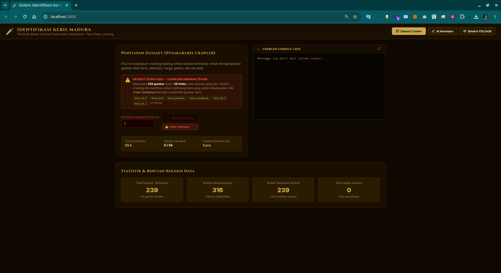
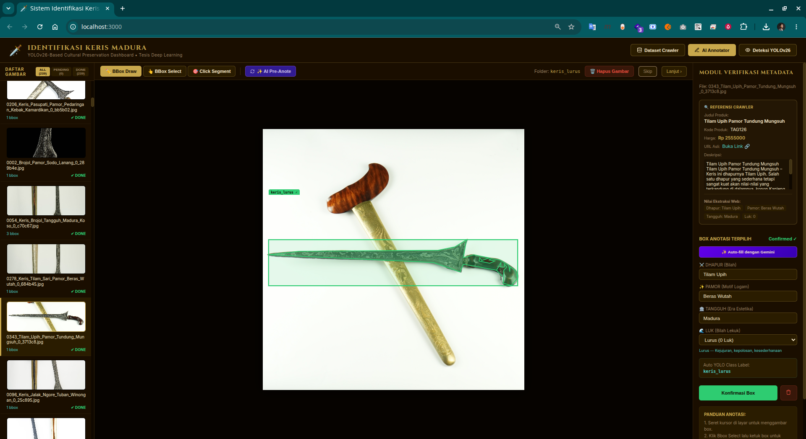
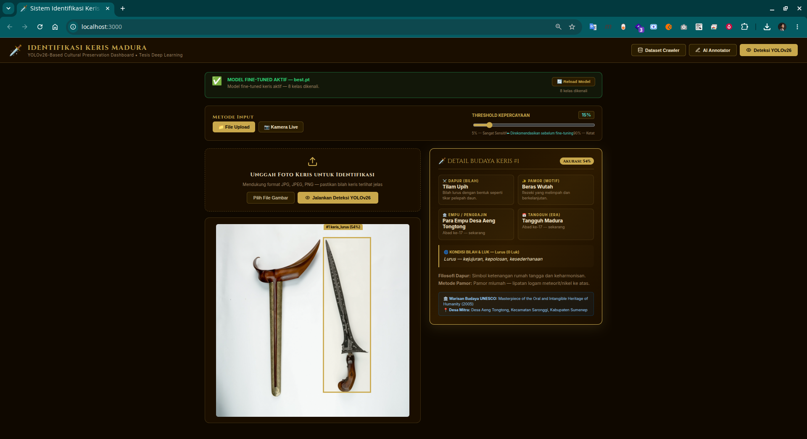
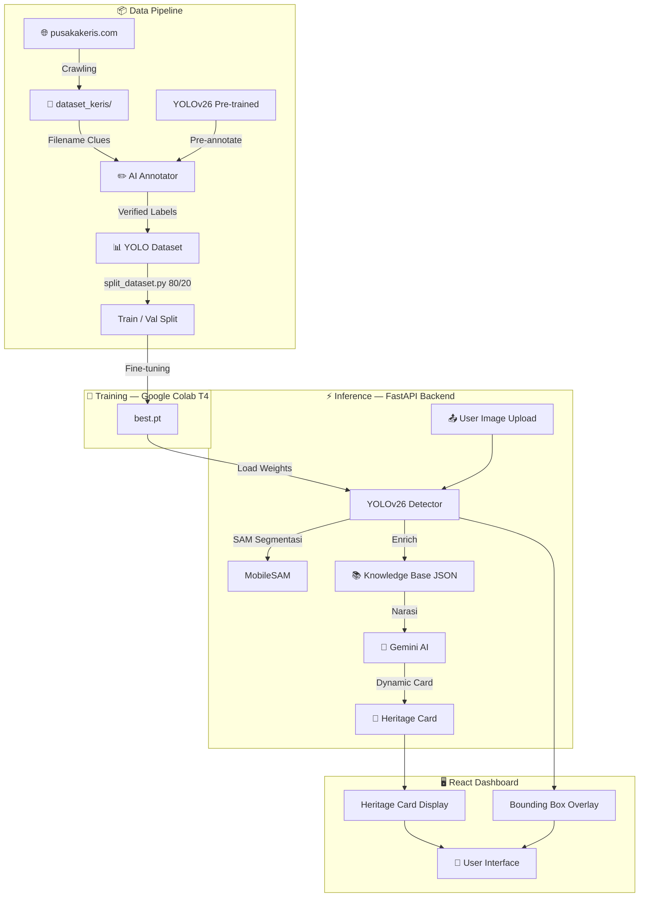

<div align="center">


# 🗡️ Kris Detection YOLOv26

### _AI-Powered Madura Cultural Heritage Preservation System_

[](https://python.org)
[](https://fastapi.tiangolo.com)
[](https://react.dev)
[](https://vitejs.dev)
[](https://docker.com)
[](https://colab.research.google.com)

[](https://docs.ultralytics.com)
[](https://github.com/astral-sh/uv)
[](https://ai.google.dev)
[](#)

---

> **Riset Tesis** — Sistem deteksi dan klasifikasi bilah keris Madura berbasis **YOLOv26** yang menggabungkan *computer vision*, knowledge base kebudayaan, dan AI generatif (Gemini) untuk pelestarian warisan budaya Nusantara secara digital.
>
> 🏛️ *Institut Sains dan Teknologi Terpadu Surabaya (ISTTS), 2026*

---

</div>

## 📸 Screenshots

<div align="center">

| 🕷️ Dataset Crawler | ✏️ AI Annotator | 🔍 Deteksi Keris |
|:--:|:--:|:--:|
|  |  |  |

</div>

---

## ✨ Fitur Utama

<table>
<tr>
<td width="50%">

### 🕷️ Dataset Crawler & Builder
Otomasi scraping katalog detail dari `pusakakeris.com/katalog` (hingga 54 halaman) — mengumpulkan gambar beresolusi tinggi, metadata Dapur, Pamor, Tangguh, dan harga secara aman dengan *politeness rate-limit*.

### ✏️ AI-Assisted Canvas Annotator
Antarmuka visual interaktif untuk menggambar Bounding Box dengan bantuan rekomendasi offline YOLOv26 (**AI Pre-Annotate**) dan parse metadata otomatis dari nama file.

### 🧠 YOLOv26 Object Detector
Identifikasi real-time menggunakan arsitektur **YOLOv26** + **MobileSAM** segmentasi untuk melokalisasi bilah keris secara instan dengan akurasi tinggi.

</td>
<td width="50%">

### 🏺 Madura Cultural Heritage Cards
Menampilkan detail **Dapur** (bentuk bilah), **Pamor** (motif tempa), **Tangguh** (era pembuatan), **Empu** pembuat, serta nilai filosofis kearifan lokal Sumenep — diakui UNESCO sebagai *Intangible Cultural Heritage*.

### 🤖 Gemini AI Integration
Deskripsi keris yang kaya dan naratif dihasilkan secara otomatis menggunakan **Google Gemini AI** (`google-genai`) berdasarkan hasil deteksi dan knowledge base budaya.

### 📓 Google Colab Ready
Notebook `.ipynb` mandiri untuk training dan evaluasi penuh di **GPU T4 gratis**, termasuk auto-clone repo, split dataset, dan upload model hasil training.

</td>
</tr>
</table>

---

## 🏗️ Arsitektur Sistem



---

## 🛠️ Stack Teknologi

| Layer | Teknologi | Keterangan |
|---|---|---|
| **Backend** | Python 3.13, FastAPI, Uvicorn | REST API server utama |
| **Deep Learning** | Ultralytics YOLOv26, MobileSAM | Deteksi & segmentasi bilah |
| **Computer Vision** | OpenCV, Pillow, NumPy | Preprocessing & postprocessing |
| **AI Generatif** | Google Gemini (`google-genai`) | Narasi kebudayaan otomatis |
| **Frontend** | React 18, Vite 5, Lucide Icons | Dashboard interaktif |
| **Styling** | Vanilla CSS (Golden Cultural Palette) | Desain heritage emas |
| **Package Manager** | `uv` (Rust-powered) | Python env management |
| **Containerisasi** | Docker, Docker Compose | Deployment multi-service |
| **Training** | Google Colab T4 (`.ipynb`) | GPU training gratis |
| **Web Scraping** | BeautifulSoup4, Requests | Crawling katalog keris |

---

## 📂 Struktur Project

```
kris-detection-yolov26/
│
├── 🐍 backend/
│   ├── app.py                  # FastAPI server utama (REST API + WebSocket)
│   ├── crawler.py              # Scraping katalog & gambar dari pusakakeris.com
│   ├── detector.py             # YOLOv26 inference + MobileSAM + Gemini narasi
│   └── knowledge_base.json     # Knowledge Base kebudayaan Madura (Dapur/Pamor/Empu)
│
├── ⚛️  frontend/
│   ├── src/
│   │   ├── App.jsx             # Dashboard React utama (Crawler/Annotator/Deteksi)
│   │   ├── index.css           # Design system (golden heritage palette)
│   │   └── main.jsx            # Entry point React
│   ├── package.json            # Dependensi npm (React 18, Vite 5, Lucide)
│   └── vite.config.js          # Dev server proxy ke FastAPI :8000
│
├── 📓 colab/
│   └── YOLOv26_Kris_Detection_Colab.ipynb  # Notebook training GPU T4
│
├── 📸 screenshots/             # Tangkapan layar fitur (crawler/annotator/deteksi)
│
├── 🐳 Dockerfile               # Multi-stage build (full stack)
├── 🐳 Dockerfile.backend       # Backend-only image (FastAPI + YOLO)
├── 🐳 Dockerfile.frontend      # Frontend-only image (React + Nginx)
├── 🐳 docker-compose.yml       # Orkestrasi multi-container
│
├── 🤖 best.pt                  # ⚠️ TIDAK DISERTAKAN — hasil training Colab (lihat panduan)
├── 🤖 mobile_sam.pt            # ⚠️ TIDAK DISERTAKAN — unduh manual dari HuggingFace (lihat panduan)
├── 📊 split_dataset.py         # Script pembagian dataset 80/20 Train/Val
├── ⚙️  pyproject.toml           # Manajemen dependensi Python via uv
├── 🔒 uv.lock                  # Lockfile deterministic (Python packages)
├── 🌐 DEPLOY_EDGE.md           # Panduan deployment Armbian/Raspberry Pi
├── 🔑 .env.example             # Template konfigurasi environment
└── 📖 README.md
```

---

## ⚠️ Persiapan Model Weights (Wajib Sebelum Menjalankan)

> **File `.pt` tidak disertakan di repositori** karena ukurannya besar dan masuk dalam `.gitignore`.
> Anda wajib menyiapkan kedua file berikut sebelum backend dapat berjalan penuh.

### 🧠 Model 1: `best.pt` — Fine-tuned YOLOv26 (Hasil Training)

File ini adalah **model utama** deteksi keris yang dihasilkan setelah proses training di Google Colab.
Tanpa file ini, sistem akan fallback ke model pre-trained YOLOv26 generik (kemampuan deteksi keris terbatas).

**Urutan prioritas loading model oleh backend:**
```
1. runs/keris/yolov26_madura_kris/weights/best.pt  ← output langsung dari Colab
2. runs/keris/weights/best.pt
3. best.pt                                          ← ✅ letakkan di sini (root project)
4. yolo26n.pt                                       ← pre-trained fallback
5. yolov8n.pt                                       ← fallback terakhir (auto-download)
```

**Langkah mendapatkan `best.pt`:**

**Step 1** — Jalankan notebook training di Google Colab:

[](https://colab.research.google.com/github/moh-affan/kris-detection-yolov26/blob/main/colab/YOLOv26_Kris_Detection_Colab.ipynb)

**Step 2** — Setelah training selesai, download file hasil training:
```
# Di dalam Colab, file best.pt ada di:
runs/keris/yolov26_madura_kris/weights/best.pt

# Download via Colab cell:
from google.colab import files
files.download('runs/keris/yolov26_madura_kris/weights/best.pt')
```

**Step 3** — Simpan file ke root folder workspace:
```bash
# Struktur folder setelah disimpan:
kris-detection-yolov26/
└── best.pt   ✅  ← letakkan di sini
```

---

### 🎯 Model 2: `mobile_sam.pt` — MobileSAM Segmentation (~40MB)

File ini digunakan oleh fitur **AI-Assisted Annotator** untuk segmentasi objek secara otomatis (pre-annotate).
Tanpa file ini, fitur annotator tetap berjalan tetapi menggunakan fallback OpenCV contour detection.

**Download `mobile_sam.pt` dari HuggingFace:**

```bash
# Opsi 1: Download langsung via wget
wget -O mobile_sam.pt https://huggingface.co/dhkim2810/MobileSAM/resolve/main/mobile_sam.pt

# Opsi 2: Download via curl
curl -L -o mobile_sam.pt https://huggingface.co/dhkim2810/MobileSAM/resolve/main/mobile_sam.pt

# Opsi 3: Download manual
# Buka https://huggingface.co/dhkim2810/MobileSAM/blob/main/mobile_sam.pt
# Klik tombol Download → simpan sebagai mobile_sam.pt di root project
```

**Simpan ke root folder workspace:**
```bash
kris-detection-yolov26/
└── mobile_sam.pt   ✅  ← letakkan di sini
```

---

### ✅ Checklist Sebelum Menjalankan

```bash
# Pastikan kedua file sudah ada di root project:
ls -lh *.pt

# Output yang diharapkan:
# -rw-r--r-- best.pt        ~20 MB
# -rw-r--r-- mobile_sam.pt  ~40 MB
```

| File | Ukuran | Fungsi | Wajib? |
|---|---|---|---|
| `best.pt` | ~20 MB | Deteksi keris (model utama) | ✅ Sangat disarankan |
| `mobile_sam.pt` | ~40 MB | AI pre-annotate (segmentasi) | ⚠️ Opsional (ada fallback) |

---

## ⚡ Panduan Menjalankan (Lokal)

### Prasyarat

Pastikan sudah terinstal:
- **Node.js** ≥ 18 & **Bun** (JavaScript runtime)
- **uv** — Python package manager berbasis Rust
- **CUDA 12.4** (opsional, untuk inferensi GPU)

```bash
# Install uv (Linux / macOS)
curl -LsSf https://astral.sh/uv/install.sh | sh

# Install uv (Windows PowerShell)
powershell -c "irm https://astral.sh/uv/install.ps1 | iex"

# Install Bun
curl -fsSL https://bun.sh/install | bash
```

---

### 1️⃣ Clone & Setup Python Environment

```bash
# Clone repositori
git clone https://github.com/moh-affan/kris-detection-yolov26.git
cd kris-detection-yolov26

# Sinkronkan virtual environment & install semua paket Python (dengan PyTorch CUDA 12.4)
uv sync
```

> 📋 Salin `.env.example` menjadi `.env` dan isi `GEMINI_API_KEY` Anda:
> ```bash
> cp .env.example .env
> # Edit .env: masukkan GEMINI_API_KEY=your_api_key_here
> ```

---

### 2️⃣ Siapkan Model Weights

Ikuti panduan [**Persiapan Model Weights**](#️-persiapan-model-weights-wajib-sebelum-menjalankan) di atas:
- Download `best.pt` dari hasil training Colab → letakkan di root project
- Download `mobile_sam.pt` dari HuggingFace → letakkan di root project

---

### 3️⃣ Jalankan Backend FastAPI

```bash
uv run python backend/app.py
# ✅ Server berjalan di http://localhost:8000
# 📖 Dokumentasi API: http://localhost:8000/docs
```

---

### 4️⃣ Jalankan Frontend Dashboard

Buka terminal baru:

```bash
cd frontend
bun install
bun dev
# ✅ Dashboard tersedia di http://localhost:3000
```

---

## 🐳 Deploy dengan Docker

Cara paling mudah untuk menjalankan seluruh stack sekaligus:

```bash
# Build & jalankan semua service (backend + frontend)
docker compose up --build -d

# ✅ Frontend: http://localhost:3080
# ✅ Backend API: http://localhost:8000 (internal)
```

```bash
# Cek status container
docker compose ps

# Lihat log real-time
docker compose logs -f

# Matikan semua service
docker compose down
```

> 📎 Untuk deployment di **Edge Device** (Armbian / Raspberry Pi / HG680P dengan RAM 2GB), lihat panduan lengkap di [`DEPLOY_EDGE.md`](DEPLOY_EDGE.md) — mencakup optimasi model ke **ONNX Runtime**, konfigurasi **Nginx**, dan setup **systemd service**.

---

## 📓 Training di Google Colab

Buka notebook di Colab untuk melakukan training dari awal menggunakan GPU T4 gratis:

[](https://colab.research.google.com/github/moh-affan/kris-detection-yolov26/blob/main/colab/YOLOv26_Kris_Detection_Colab.ipynb)

**Fitur notebook:**
- ✅ Auto-clone repositori dari GitHub
- ✅ Install semua dependensi secara otomatis
- ✅ Split dataset 80/20 Train/Val
- ✅ Training YOLOv26 dengan konfigurasi optimal T4
- ✅ Evaluasi model (mAP, Precision, Recall, Confusion Matrix)
- ✅ Export model ke `.pt` dan siap diunduh

---

## 📊 Dataset & Pipeline

### Sumber Data
| Sumber | Detail |
|---|---|
| **Pusaka Keris** | [pusakakeris.com/katalog](https://pusakakeris.com/katalog/) — 54 halaman katalog |
| **Metode** | Python Scraper (BeautifulSoup4 + Requests) |
| **Rate Limit** | 0.5–1.2 detik per request (*politeness policy*) |
| **Output** | Gambar beresolusi tinggi + metadata JSON (`checkpoint.json`) |

### Pipeline Pemrosesan
```
[1] 🕷️  Crawling          →  Gambar + Metadata (Dapur, Pamor, Tangguh, Luk, Harga)
[2] ✏️  AI Pre-Annotate   →  YOLOv26 auto-detect kandidat koordinat bilah
[3] 👁️  Manual Curation   →  Validasi & koreksi anotasi oleh kurator/ahli
[4] ✂️  Dataset Split      →  split_dataset.py → 80% Train / 20% Validation
[5] 🧠 Fine-tuning        →  YOLOv26 training on Colab T4 GPU
[6] 🚀 Deployment         →  best.pt → FastAPI inference server
```

---

## 🏛️ Latar Belakang & Knowledge Base

Knowledge Base kebudayaan keris Madura dikurasi berdasarkan studi pustaka dan sumber primer:

| # | Sumber |
|---|---|
| 1 | **Museum Keraton Sumenep** — Koleksi & arsip keris pusaka Madura, Jawa Timur |
| 2 | **Desa Aeng Tongtong**, Kec. Saronggi, Sumenep — Desa Empu tempa besi, diakui **UNESCO** sebagai *Intangible Cultural Heritage* |
| 3 | **Himpunan Ahli Keris Indonesia (HAKI)** — Referensi klasifikasi Dapur, Pamor, Tangguh |

---

## 🔑 Environment Variables

Salin `.env.example` ke `.env` dan sesuaikan:

```dotenv
# Backend API Configuration
GEMINI_API_KEY=your_gemini_api_key_here

# Frontend Configuration (untuk Docker)
VITE_BACKEND_URL=http://localhost:8000
```

---

## 📝 Sitasi & Lisensi

Repositori ini ditujukan khusus untuk **riset akademik** dan pelestarian warisan budaya digital Nusantara.

```bibtex
@thesis{affan2026kris,
  title   = {YOLOv26-Based Kris Detection and Classification
              for Madura Cultural Heritage Preservation},
  author  = {Affan, M.},
  year    = {2026},
  school  = {Institut Sains dan Teknologi Terpadu Surabaya (ISTTS)},
  note    = {Available at: https://github.com/moh-affan/kris-detection-yolov26}
}
```

---

<div align="center">

**Made with ❤️ for Madura Cultural Heritage**

*🗡️ Keris — Warisan Budaya Nusantara yang Diakui UNESCO*

[](https://istts.ac.id)
[](https://ich.unesco.org)

</div>
